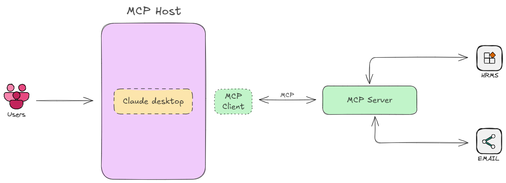

# HR AI Agent
HR AI Agent is an intelligent, MCP-powered HR assistant designed to automate and streamline core HR operations.  
It integrates tools, knowledge bases, and workflows to manage employees, leave requests, meetings, ticketing, and onboarding — all accessible via a conversational AI interface.  

Built on **FastMCP**, the agent seamlessly integrates with Claude Desktop and other MCP-compatible clients. With support for HRMS operations, emails, and workflow automation, it reduces manual overhead and enhances productivity for HR teams.  

▶️ **[Watch the Project Demo on YouTube](https://youtu.be/oGgQIMMyKgU)**

| Module              | Features                                                                 |
|----------------------|--------------------------------------------------------------------------|
| **Employee Management** | • Add employees • Manage employee records • Retrieve employee details |
| **Leave Management**    | • Apply leave • Track leave requests • Check leave balance & history |
| **Meeting Management**  | • Schedule meetings • Fetch meeting details • Cancel meetings |
| **Ticketing System**    | • Raise support tickets • Update tickets • Track ticket status |
| **Email Integration**   | • Send HR emails (via Gmail SMTP) • Automated onboarding notifications |
| **Onboarding Workflow** | • Add employees to HRMS • Automate onboarding |


## Use Cases
- Automating HR operations for small and medium-sized companies  
- Streamlined employee onboarding & offboarding  
- Self-service HR queries for employees  
- AI-driven workflows to boost HR team productivity  

## Technical Architecture


## Installation Guide
Follow these steps to set up and run the project on your system

### **Prerequisites**
Install ```uv```
```
powershell -ExecutionPolicy ByPass -c "irm https://astral.sh/uv/install.ps1 | iex"  # Windows
curl -LsSf https://astral.sh/uv/install.sh | sh                                     # Linux/Mac
```

### **1. Clone the Repository**
```
git clone https://github.com/lintosunny/hr-ai-agent.git
```

### **2. Create a virtual environment & install dependencies**
```
uv sync
```

### **3. Activate the Virtual Environment**
```
source .venv/bin/activate  # Linux/Mac
.venv\Scripts\activate     # Windows
```

### **4. Install Claude Desktop**
Download and install Claude Desktop from *[here](https://claude.ai/download)*

### **5. Configure Google App Password**
1. Go to: *[Google Account Security](myaccount.google.com/security)*
2. Enable 2-Step Verification
3. Create an App Password at *[Google App Passwords](myaccount.google.com/apppasswords)*
4. Enter an app name → click Create → copy and save the generated password

### **6. Add Claude Config File**

Open Claude Desktop and navigate: *Menu → File → Settings → Developer → Edit config*

Locate ```claude_desktop_config.json``` and add the following:

```
{
  "mcpServers": {
    "hr-assist": {
      "command": "C:\\Users\\linto\\.local\\bin\\uv",  // Replace with your uv.exe system path
      "args": [
        "--directory",
        "C:\\Users\\linto\\code\\hr-ai-agent",  // Replace with your project folder path
        "server.py"
      ],
      "env": {
        "CB_EMAIL": "<enter your email here>",
        "CB_EMAIL_PWD": "<enter your generated app password here>"
      }
    }
  }
}
```

### **7. Run the AI agent**
1. Open Claude Desktop
2. Click + → select Add from hr assistant
3. Run a prompt and provide required details

If changes do not reflect:
* Close Claude Desktop
* Kill the task from Task Manager
* Reopen the app